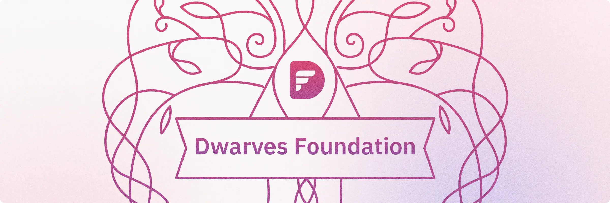
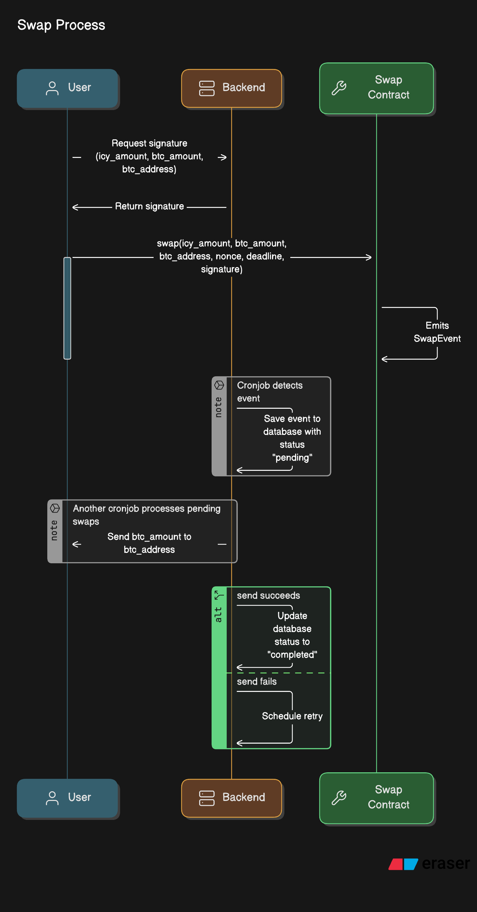
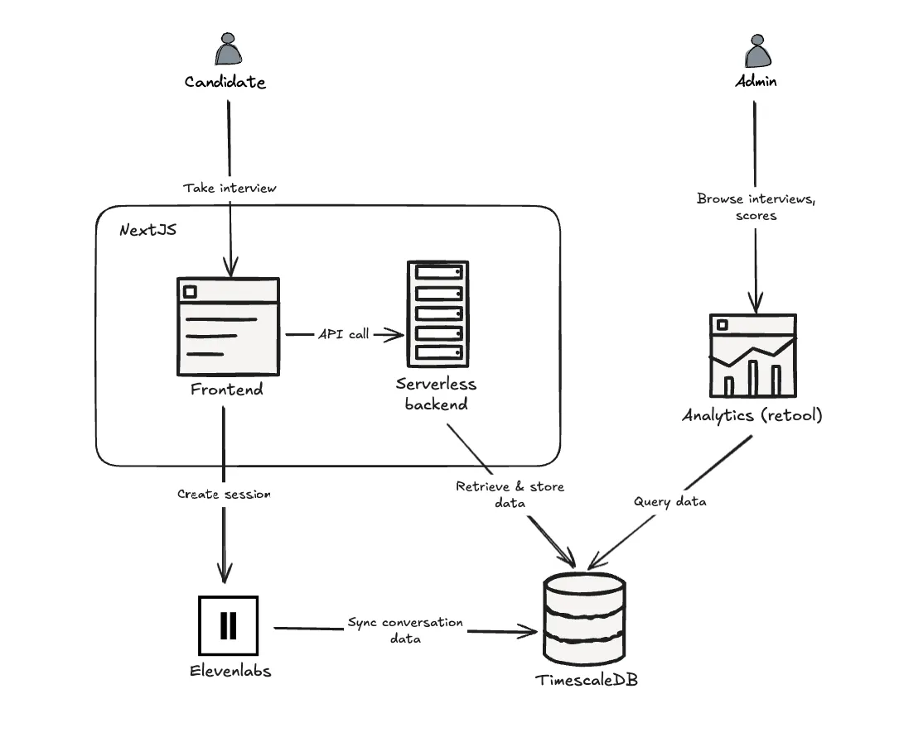

---
tags:
  - dwarves
  - work
  - home
title: Home
date: 2023-12-11
description: A collection of notes for everything we do and operate at Dwarves. This is where we keep our internal notes.
authors:
  - minhcloud
  - monotykamary
  - hnh
hide_frontmatter: true
hide_title: true
---

Welcome to the Dwarves Memo.

This site is a part of our continuous learning engine, where we want to build up the 1% improvement habit, learning in public.

Written by Dwarves for product craftsmen.

Learned by engineers. Experimented by engineers.

## 💡 OGIFs

- [#28 Go sync.Map, AI UX, Yelp AI, LLM Patterns, Git Analysis](/updates/ogif/28-20241018)
- [#27 Go weekly, Frontend, AI UX, Finite Automata](/updates/ogif/27-20241011)
- [#26 Design insights, Go tools, Trading app, Chatbots, Essays](/updates/ogif/26-20241004)
- [#25 Team updates, Hybrid work, AI insights, Go weekly](/updates/ogif/25-20240927)
- [#24 Go weekly, AI workflows, Team AI demo, Figma-UI with Claude](/updates/ogif/24-20240920)

## ✨ New memos

- 

<a class="v-list-item-title" href="/playground/blockchain/cross-chain-transfers-implementing-a-token-swap-from-base-chain-to-bitcoin">Implement a Token Swap from the base chain to Bitcoin for cross-chain transactions</a>
This guide shows how to implement a token swap from the Base Chain to Bitcoin.

<a href="/contributor/quang">quang</a>

<a class="v-list-item-title" href="/playbook/community/how-to-swap-icy-to-btc-copy">How much is your ICY worth</a>
ICY is shifting from a fixed USDC-backed value to a dynamic, Bitcoin-backed model. Learn how this change impacts holders, market liquidity, and value fluctuations.

<a href="/contributor/hnh">hnh</a>

<a class="v-list-item-title" href="/playground/use-cases/ai-interview-platform-mvp">Building MVP for AI-driven interview platform</a>
Discover how our two-week MVP harnesses AI-driven, real-time voice processing to streamline interviews, reduce bias, and accelerate hiring success

<a href="/contributor/thanh">thanh</a>

## 🧑‍💻 Life at Dwarves

- 

<a class="v-list-item-title" href="/updates/digest/15-new-year-gathering">#15 New year gathering</a>
Tết break came to an end, and the Dwarves team reunited to share stories, reconnect, and kick off the Year of the Snake in style. We brought it all back to Discord—along with a little SOL & ICY drop to start the year right.

February 04, 2025

<a class="v-list-item-title" href="/updates/changelog/2024-in-review">2024 In Review</a>
Closing another milestone with 2024, it has been a year of building and rebuilding — strengthening what works, fixing what doesn’t, and uncovering new paths along the way. Every milestone reached this year carries the marks of teamwork and persistence.

January 16, 2025

<a class="v-list-item-title" href="/updates/changelog/2024-summit-building-bonds-our-way">Summit 2024: Building bonds our way</a>
Our first international summit took us to Penang, where remote connections turned into real-world chemistry. No rigid schedules or forced activities - just authentic moments of teams choosing their own adventures, from heritage streets to beach sunsets. See how giving people space to connect creates something truly special.

December 24, 2024

</a>

## 📝 Changelog

- 

<a class="link-v-list-item-title" href="/updates/digest/15-new-year-gathering">#15 New year gathering</a> - February 04, 2025

<a class="link-v-list-item-title" href="/updates/digest/14-back-to-the-office">#14 Hybrid work harmony</a> - September 25, 2024

<a class="link-v-list-item-title" href="/updates/digest/13-more-than-lines-of-code">#13 More than lines of code</a> - July 20, 2024
</a>

## 🤝 Open positions

- 

<a class="v-list-item-title" href="/careers/open-positions/full-stack-engineer">Full-Stack Engineer</a>
We are looking for a Full-Stack Engineer who is passionate about building scalable, secure, and efficient web applications. The ideal candidate will have a strong understanding of both frontend and backend technologies, and the ability to work across the entire stack.

</a>

---

  <h6>Love what we are doing?</h6>
  <ul>
    <li>
      <a href="https://discord.gg/dwarvesv">🩷 Join our Discord Network →</a>
    </li>
    <li>
      <a href="https://github.com/dwarvesf/playground">🔥 Contribute to our Memo → </a>
    </li>
    <li>
      <a href="https://careers.d.foundation/">🤝 Join us, we are hiring →</a>
    </li>
    <li>
      <a href="http://memo.d.foundation/earn/"> 🙋 Give us a helping hand →</a>
    </li>
  </ul>

